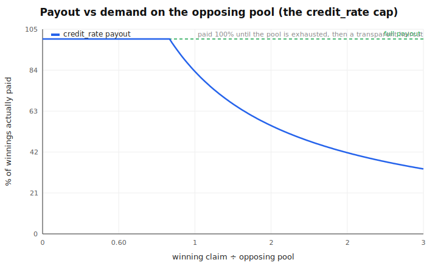
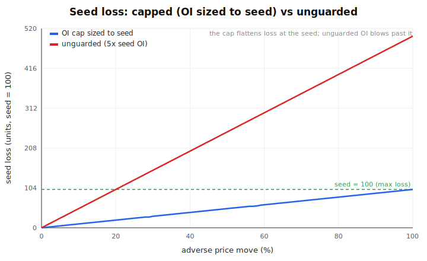
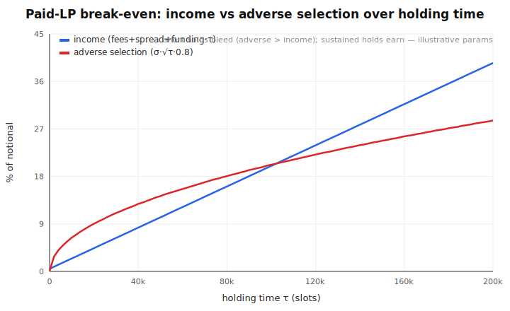
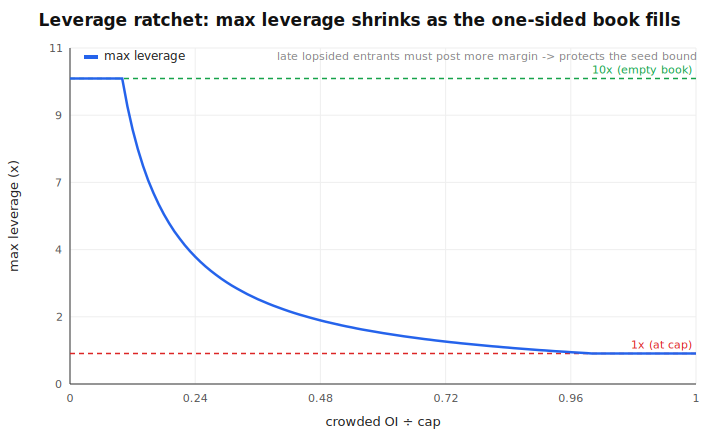

# Permissionless Perps for Long-Tail Tokens — Design A

A design for launching a leveraged **perpetual** market on *any* token — memecoins and long-tail
assets included — without deep liquidity, market makers, or a vault that can be drained. It is
**safe by construction** (the protocol can never go insolvent), and the trade-offs are stated
honestly rather than hidden.

This repository is the **design + a formal economic model with proofs + graphs** of what we believe
will work. It is **not a deployed system** and not an implementation. It is shared for feedback.

- **The model + proofs:** [`model/`](model) — an integer (`u128`) model of the economics with
  Kani formal proofs and large stress sweeps.
- **The graphs:** [`graphs/`](graphs) — generated directly from the same formulas as the proofs.

---

## The problem

On a long-tail or memecoin market, flow is **one-sided** by nature: almost everyone wants to be
long the thing that's pumping. There is no natural counterparty, and professional market makers
don't show up for a coin that launched an hour ago. Every existing model breaks here:

- **A vault / AMM as the counterparty** bleeds without bound on sustained one-way flow. This is the
  Hyperliquid HLP / JELLY failure (March 2025): a thin one-sided market nearly drained a ~$230M
  vault.
- **A central order book** needs market makers that long-tail markets don't have.

## The one rule everything obeys (no free lunch)

When leveraged longs win, **someone** pays them. On a one-sided book the money can only come from
one of exactly four places: real opposing traders (don't exist), a vault/LP, the creator, or the
token's own spot market. There is no fifth source. So the real design question was never "how do we
avoid a loser" — it's **"who is the counterparty, and are they paid enough to take that side and
survive?"**

## Design A

The answer in one line: **match real traders peer-to-peer first; for the one-sided residual, a
*bounded, paid* seed takes the other side; settlement is parimutuel so the protocol never goes
insolvent; lopsided markets bleed their bounded seed and die, balanced markets survive.**

```
  taker order
      │
      ▼
 ┌─────────────────────┐   yes    ┌───────────────────────────────┐
 │ real opposing taker? ├────────► │ PATH P: peer-to-peer match     │  zero house risk
 └──────────┬──────────┘          │ (the two traders fund each     │
            │ no                   │  other, parimutuel settlement) │
            ▼                      └───────────────────────────────┘
 ┌──────────────────────────────────────────────┐
 │ PATH R: bounded seed is the counterparty       │  seed is PAID (fees + spread + funding),
 │ • fill clipped to the seed's depth (OI cap)    │  loss hard-capped at the seed,
 │ • winners paid via credit_rate (never insolvent)│  protocol can never bleed
 └──────────────────────────────────────────────┘
```

Four pieces make it safe **and** a real product:

1. **Peer-to-peer first.** Where two real sides exist, they fund each other and nobody bleeds. The
   seed only ever covers the *residual* imbalance, so its exposure is a fraction of the book.
2. **The seed is *paid*, not just bounded.** It earns trading fees + price-impact spread + funding
   for taking the unpopular side. "Does it bleed?" stops being structural doom and becomes a
   *pricing* question — set funding/fees above the expected directional cost and the seed is a
   yield role, not a sacrifice. (This is how GMX/HLP-style backstops stay net-positive; their only
   fatal flaw was an *unbounded* tail, which we cap.)
3. **Parimutuel settlement.** Winners are paid out of the losing side's collateral, capped by a
   `credit_rate = min(1, backing / claim)` haircut. The protocol holds no position and only
   redistributes posted collateral, so **it cannot go insolvent** — there is nothing to drain.
4. **Per-market isolation + an OI cap sized to the seed.** Each market is its own isolated pool, and
   the open-interest cap is set so the seed's worst-case loss can never exceed the seed. A blown
   market dies cheaply without touching any other.

### What a trader experiences

- **A two-sided book:** full 1:1 payout — indistinguishable from a normal perp.
- **A thin, one-sided book:** a transparent, on-chain-readable haircut bounded by the available
  backing, instead of a vault quietly detonating. Funding pays you to take the unpopular side, which
  pulls the book back toward balance.
- **Leverage** is gated by how full the one-sided book is: generous when the book is empty,
  ratcheting down as it crowds — so late lopsided entrants can't breach the seed's loss bound.

---

## Graphs

**Payout is full until the opposing pool is exhausted, then a transparent haircut.** The
`credit_rate` cap is the whole solvency story: you are paid 100% while the winning claim fits inside
the opposing pool, and a bounded fraction beyond it. The protocol never pays out money that wasn't
posted.



**The OI cap bounds the seed's loss at the seed.** Sizing the open-interest cap to the seed makes
the worst-case loss flatten exactly at the seed, no matter how far the price moves. An unguarded
position (here 5× the seed) blows straight past it — that's the failure the cap removes.



**The paid seed earns on time, bleeds on fast pumps.** Funding income grows with holding time while
adverse selection grows with its square root, so short violent holds lose and sustained markets
earn. This is the honest break-even: the seed is a *paid, tail-bounded* role, not guaranteed yield.



**Leverage ratchets down as the one-sided book fills.** Generous leverage on an empty book,
tightening to 1× at the cap — this is what keeps a late one-sided rush from breaching the bound.



---

## What we can prove (the model)

[`model/`](model) is a self-contained integer model of the economics, with **13 Kani formal proofs
and 26 stress / worked-example tests, all passing**. Crucially, the proofs are **non-vacuous**: an
adversarial pass mutation-tests them, and a real bug genuinely fails the suite (e.g. breaking the
payout to overpay winners makes the exhaustion test fail). Proven, among others:

- **Solvent by construction** — winners can never draw more than the available backing; the seed's
  loss is bounded by the seed for *any* price move.
- **The OI cap is load-bearing** — sizing it to the seed keeps winners paid in full in-tier and the
  loss bounded.
- **No insolvency under exhaustion** — as backing drains, the payout rate falls monotonically to a
  floor and a winner is never overpaid.
- **Funding is zero-sum** with the correct sign (crowded side pays thin side), and its magnitude can
  never exceed the payer.
- **Break-even reproduces both regimes** — a fast pump bleeds, a sustained market earns.
- **Conservation** across multi-step price + funding paths; **OI parity** preserved on close.

```bash
cd model
cargo test     # 26 stress + worked-example tests
cargo kani     # 13 formal proofs + non-vacuity cover checks
```

> **Model scope (honest):** this proves the *economics*. It is not a 1:1 mirror of any production
> engine — the on-chain settlement has additional backing terms the model omits, so the on-chain
> bounds **must be re-verified in real integration tests**. The model says the design is sound in
> principle; it does not say the implementation is done.

## How it sits on an existing engine

Design A is built to layer on a **matched-book perpetual engine whose settlement is already
parimutuel-shaped** (winners paid from the opposing side, capped by a credit-rate haircut, loss
bounded by posted capital). The result of a full design pass: it needs **no changes to the core
settlement engine** — only **one new small on-chain program** (so a program-owned seed can act as
the residual counterparty), **additive matcher changes** (the seed-sized fill cap), and
**market-creation-time configuration**. Implementation details are kept out of this public repo.

## Honest caveats / open problems (no surprises)

- **Taker routing is the load-bearing unsolved piece.** Filling a real taker's order against the
  program-owned seed in one atomic step is non-trivial and must be designed before any build — it
  decides the whole scope.
- **Fresh-memecoin oracles aren't fully safe.** A token with only a thin own-market price can be
  manipulated for less than the seed. Markets with a real price feed are safe; the thinnest case
  ships behind tight caps, or not at all.
- **Permissionless to launch, but a keeper operates it.** Mitigated by a permissionless fallback
  crank, an on-chain funding-sign check, and a path for users to always close without the keeper —
  but it is a real centralization point and is stated as such.
- **Profitability is unproven at the frontier.** Nobody has publicly demonstrated a profitable
  permissionless one-sided memecoin leverage product. The seed is a *tail-bounded, paid* role that
  survives by market selection — not guaranteed yield.

## Lineage

This is the hardened descendant of an earlier "guardrailed vAMM + creator first-loss + per-market
OI cap" design. The core (a bounded creator stake as the one-sided counterparty + a per-market OI
cap) is unchanged; what this work added is peer-to-peer-first matching (so the seed only covers the
residual), the *paid* seed (which fixes the "it just bleeds" problem), parimutuel solvency proven
non-vacuously, and the honest blockers above.

## License

Apache-2.0 — see [LICENSE](LICENSE).
